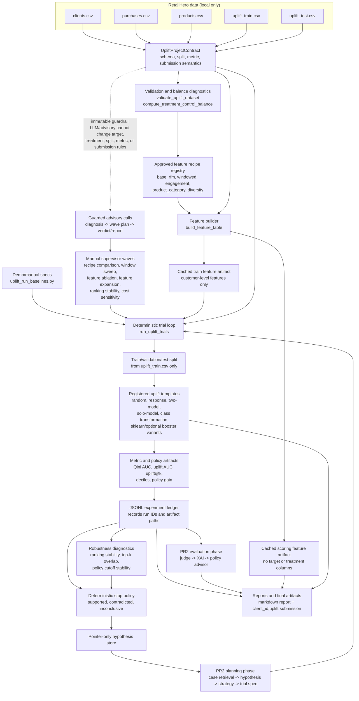

# BT5153 Agentic Uplift Modeling

This repository contains the BT5153 project code for the X5 RetailHero uplift-modeling task.

The current codebase is intentionally narrow. It focuses on a reliable uplift-modeling kernel first, then adds an agentic supervisor only after the measurement and experiment loop are trustworthy.

## Current Scope

The project answers one business question:

> Which customers should receive a campaign treatment, and how robust is that targeting decision?

Implemented so far:

- Contract-driven RetailHero table and column semantics.
- Dataset validation for labeled training data and unlabeled scoring data.
- Treatment/control balance diagnostics.
- Cached customer-level feature construction from clients, purchases, and approved product/category expansions.
- Uplift metrics: Qini AUC, uplift AUC, uplift@k, decile tables, and policy gain.
- Deterministic templates: random, response model, two-model, solo-model, class transformation, sklearn logistic/gradient boosting, and optional XGBoost/LightGBM/CatBoost two-model variants.
- JSONL experiment ledger with cached model, prediction, uplift-score, metric, curve, report, and submission artifacts.
- PR2-style planning and evaluation phase names for teammate-facing orchestration: planning agents, evaluation judge, XAI reasoner, policy advisor, and shared LLM client.
- PR1-style orchestration names for the end-to-end demo path: AutoLift orchestrator, retry controller, manual benchmark, and final reporting agent.
- Guarded advisory planning/reporting path that cannot mutate target, treatment, split, metric, or submission semantics.
- Pointer-only hypothesis records for the next supervisor layer.
- Manual supervisor waves for recipe comparisons, window sweeps, feature ablations, and controlled feature-group expansions that validate dependencies, run comparable trial specs, and return ledger pointers.
- Deterministic stop decisions that map wave evidence to supported, contradicted, or inconclusive hypothesis states without LLM authority.
- Strict advisory diagnosis, wave-planning, verdict, and report calls that retry invalid JSON and reject contract, metric, template, feature-recipe, or artifact-citation violations.
- Controlled feature recipe registry for approved base, RFM, windowed, engagement, product/category, and diversity expansions.
- Robustness diagnostics for seed-repeat ranking stability, top-k overlap, and policy cutoff stability under communication-cost scenarios.

Not included in this cleaned BT5153 repo:

- Previous generic Agentic ML framework experiments.
- Internal planning notes, implementation logs, Graphify/GSD artifacts, and agent scratch files.
- Raw RetailHero data or generated experiment artifacts.
- Free-form code generation or broad AutoML.

For the teammate-aligned planning notes, see `teammate-aligned-uplift-roadmap.md`.

## Current Architecture Pipeline



## What Is In This Repo So Far

The repo currently contains the deterministic uplift kernel and the first hypothesis-memory layer. The files under `src/` are the reusable project code:

- `src/models/uplift.py`: Pydantic contracts for RetailHero table paths, split policy, evaluation policy, feature recipes, feature artifacts, trial specs, supervisor waves, wave results, stop decisions, advisory outputs, result cards, ledger records, submission artifacts, and pointer-only hypotheses.
- `src/uplift/validation.py`: dataset validation, treatment/control balance diagnostics, and stratification feasibility checks.
- `src/uplift/features.py`: deterministic customer-level feature builder from `clients.csv`, `purchases.csv`, and approved `products.csv` expansions, including cached feature artifact metadata.
- `src/uplift/recipe_registry.py`: approved recipe-family registry that maps supervisor expansion requests to deterministic feature recipes and cached artifacts.
- `src/uplift/splitting.py`: labeled train/validation/test splitting from `uplift_train.csv` only.
- `src/uplift/metrics.py`: Qini curve/AUC, uplift curve/AUC, uplift@k, decile tables, and policy-gain helpers.
- `src/uplift/templates.py`: registered learners: random, response model, two-model uplift, solo-model uplift, class transformation, sklearn logistic/gradient boosting, and optional XGBoost/LightGBM/CatBoost boosters.
- `src/uplift/loop.py`: deterministic trial runner that executes registered templates, writes cached model/prediction/uplift-score/curve/decile/result artifacts, and appends ledger records.
- `src/uplift/ledger.py`: JSONL ledger for trial-level evidence.
- `src/uplift/planning_agents.py`: PR2-style `ExperimentPlanningPhase` with case retrieval, hypothesis reasoning, strategy selection, and trial-spec writing.
- `src/uplift/evaluation_agents.py`: PR2-style Judge/XAI/Policy evaluation phase over computed uplift scores.
- `src/uplift/policy.py`: business-facing targeting threshold, budget, ROI, segment, and decile summaries.
- `src/uplift/llm_client.py`: shared callable LLM wrapper with an offline stub for tests and demos.
- `src/uplift/xai.py`: cached-model permutation sensitivity, score/feature association fallback, representative cases, leakage checks, and optional SHAP helpers.
- `src/uplift/orchestrator.py`: PR1-style `AutoLiftOrchestrator`, `RetryControllerAgent`, `ManualBenchmarkAgent`, and `ReportingAgent` names over the current PR2/core flow, including decision, policy, XAI, retry, hypothesis-loop, and representative-case report sections.
- `src/uplift/reporting.py`: markdown report generation plus final `client_id,uplift` submission generation and validation.
- `src/uplift/planner.py`: guarded advisory planner/reporting path; it can suggest from allowed structures but cannot change contract semantics.
- `src/uplift/hypotheses.py`: hypothesis lifecycle helpers and a JSONL-backed `UpliftHypothesisStore`.
- `src/uplift/supervisor/`: deterministic manual wave runner, stop policy, advisory call boundary, and robustness diagnostics; it validates known templates, feature recipes, windows, feature groups, hypotheses, artifacts, and immutable contract fields before trial execution or narrative output.

The `demos/` folder contains teammate-facing commands that exercise the kernel without needing to read the internals:

- `demos/uplift_validate_dataset.py`: validates the RetailHero-style files and prints schema/balance diagnostics.
- `demos/uplift_build_features.py`: builds cached customer-level feature artifacts for train, scoring, or all cohorts.
- `demos/uplift_run_baselines.py`: builds features, runs the baseline ladder, writes ledger/artifacts/report/submission outputs, and prints a summary.

The `tests/` folder keeps a tiny RetailHero-like fixture dataset and regression coverage for contracts, validation, feature building, metrics, baselines, ledger records, supervisor waves, stop decisions, advisory calls, reports, submissions, hypotheses, and demo scripts.

## Setup

Use Python 3.12+.

```bash
python3 -m venv .venv
source .venv/bin/activate
pip install -e ".[dev]"
```

For the optional teammate booster templates and SHAP explanations:

```bash
pip install -e ".[dev,boosters,xai]"
```

If you prefer requirements files:

```bash
pip install -r requirements.txt
```

## Test

Run the teammate-facing uplift suite:

```bash
python3 -m pytest \
  tests/models \
  tests/uplift \
  tests/integration/test_uplift_validate_demo.py \
  tests/integration/test_uplift_build_features_demo.py \
  tests/integration/test_uplift_run_baselines_demo.py \
  -q
```

Expected current result:

```text
148 passed
```

## Demo With Tiny Fixtures

Validate the fixture dataset:

```bash
python3 demos/uplift_validate_dataset.py --data-dir tests/fixtures/uplift
```

Build cached features:

```bash
python3 demos/uplift_build_features.py \
  --data-dir tests/fixtures/uplift \
  --output-dir artifacts/uplift/features \
  --cohort train \
  --chunksize 10 \
  --force
```

Run the baseline ladder:

```bash
python3 demos/uplift_run_baselines.py \
  --data-dir tests/fixtures/uplift \
  --output-dir artifacts/uplift/baseline_runs \
  --chunksize 10 \
  --small-fixture-mode
```

Generated artifacts are intentionally ignored by Git.

## Running On RetailHero Data

Place the real RetailHero CSV files locally under:

```text
retailhero-uplift/data/
  clients.csv
  purchases.csv
  products.csv
  uplift_train.csv
  uplift_test.csv
```

The raw dataset is not committed to this repo.

Then run the same demo commands without `--data-dir tests/fixtures/uplift`.

## Design Philosophy

The project now uses PR2's teammate-facing phase names and selected PR1 orchestration names over a tested execution kernel:

- Planning and evaluation should be easy to explain through `ExperimentPlanningPhase`, `UpliftEvaluationJudge`, `UpliftXAIReasoner`, and `UpliftPolicyAdvisor`.
- End-to-end demos should be easy to explain through `AutoLiftOrchestrator`, `RetryControllerAgent`, `ManualBenchmarkAgent`, and `ReportingAgent`.
- Contracts own target, treatment, metric, split, and submission semantics.
- The experiment kernel owns fitting, scoring, and metric artifacts.
- LLM calls may propose hypotheses and narratives, but cannot rewrite contracts or bypass validation.
- Raw purchase data is scanned only when building cached feature artifacts, not inside every experiment loop.

This keeps the project demo-friendly for teammates while preserving tested metrics, ledger records, and artifact boundaries.
