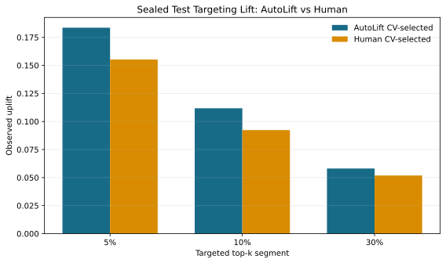
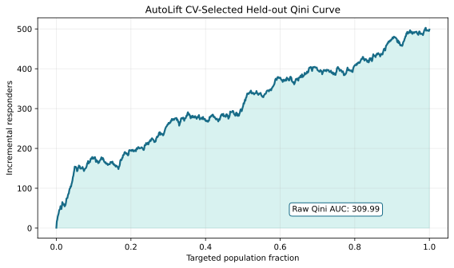
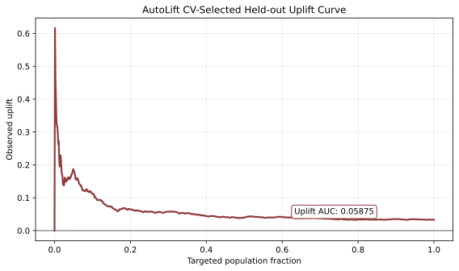
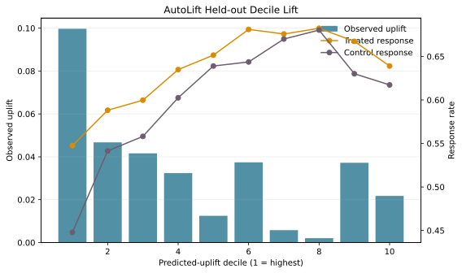
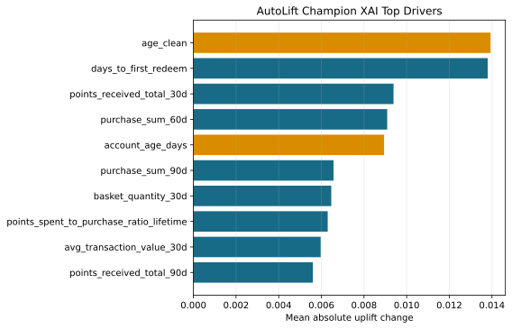
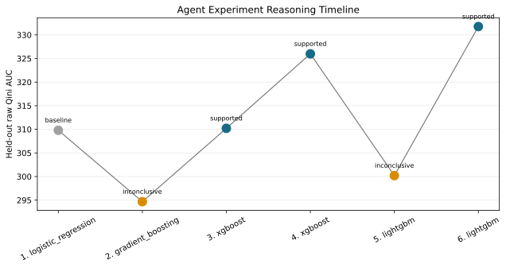

# AutoLift Explainability Pack

This pack adapts the visual explanation structure from `human_baseline_uplift.ipynb` for the AutoLift run. It adds model-performance visuals, targeting diagnostics, feature-level explanation, and an agent decision timeline.

## Final Honest Human vs AutoLift

Both sides are selected without using the sealed test set. The human notebook
selects `solo_model_xgb` by 5-fold CV after validation screening. AutoLift
selects `RUN-f1c30175` / `two_model_lightgbm` by validation-top-3 CV.

| Metric | AutoLift CV-selected | Human CV-selected | AutoLift - Human |
| --- | --- | --- | --- |
| CV mean normalized Qini | 0.396226 | 0.409490 | -0.013264 |
| CV std normalized Qini | 0.060313 | 0.087550 | -0.027237 |
| Test normalized Qini | 0.248455 | 0.204120 | +0.044335 |
| Test raw Qini AUC | 309.987113 | 299.125590 | +10.861523 |
| Test uplift AUC | 0.058746 | 0.057820 | +0.000926 |
| Test uplift@5% | 0.183569 | 0.155200 | +0.028369 |
| Test uplift@10% | 0.111772 | 0.092310 | +0.019462 |
| Test uplift@30% | 0.058085 | 0.051870 | +0.006215 |

The table above is the final honest comparison. The SVG is retained from the
earlier retrospective visual pack and should be treated as a supporting visual,
not as the source of truth for the final CV-selected comparison.

## AutoLift Curves

The notebook did not leave prediction-level human artifacts in this workspace, so
the human comparison is shown through notebook-reported metrics instead of an
overlaid human curve.

## Decile Lift

The first decile is the top predicted-uplift group and should show the clearest treatment/control response separation if the ranking is useful.

## Feature Explanation

| Rank | Feature | Mean Abs Uplift Change | Direction |
| --- | --- | --- | --- |
| 1 | age_clean | 0.013934 | higher_feature_higher_uplift |
| 2 | days_to_first_redeem | 0.013803 | higher_feature_lower_uplift |
| 3 | points_received_total_30d | 0.009384 | higher_feature_lower_uplift |
| 4 | purchase_sum_60d | 0.009088 | higher_feature_lower_uplift |
| 5 | account_age_days | 0.008941 | higher_feature_lower_uplift |
| 6 | purchase_sum_90d | 0.006571 | higher_feature_lower_uplift |
| 7 | basket_quantity_30d | 0.006465 | higher_feature_lower_uplift |
| 8 | points_spent_to_purchase_ratio_lifetime | 0.006298 | higher_feature_lower_uplift |
| 9 | avg_transaction_value_30d | 0.005967 | higher_feature_lower_uplift |
| 10 | points_received_total_90d | 0.005600 | higher_feature_lower_uplift |

Age-related features remain prominent, so this explanation should be presented with the feature-policy caveat already documented in the robustness audit.

## Agent Reasoning Timeline

| Step | Run | Learner | Estimator | Held-out Qini | Verdict | Decision Evidence |
| --- | --- | --- | --- | --- | --- | --- |
| 1 | RUN-447718f5 | two_model | logistic_regression | 309.7954 | baseline |  |
| 2 | RUN-9c2b8311 | class_transformation | gradient_boosting | 294.6742 | inconclusive | The trial's hold-out uplift-AUC fell from 0.04667 (baseline) to 0.04245 and Qini-AUC from 309.80 to 294.67, so it fails to beat the existing model. |
| 3 | RUN-bfd6fa1c | two_model | xgboost | 310.2122 | supported | The trial's held-out uplift AUC rose from 0.0467 to 0.0580 (+24%), and Qini AUC edged up from 309.8 to 310.2, with uplift@5% improving to 0.1315. |
| 4 | RUN-f7bdb1dc | class_transformation | xgboost | 325.9836 | supported | The new model outperforms the prior champion on held-out uplift metrics: Qini AUC rises from 310.21 to 325.98 and uplift-AUC from 0.058026 to 0.058... |
| 5 | RUN-dd10fc91 | two_model | lightgbm | 300.1975 | inconclusive | The new model's held-out Qini AUC dropped from 325.98 to 300.20 and uplift-AUC fell from 0.0589 to 0.0563 versus the prior champion, missing the ta... |
| 6 | RUN-c5e6e86f | class_transformation | lightgbm | 331.7694 | supported | The LightGBM model improved held-out Qini AUC from 325.98 to 331.77 (up 5.79) and uplift-AUC from 0.05888 to 0.06149 (up 0.00261), both exceeding t... |

This is the agent-specific contribution: each trial carries a hypothesis, feature rationale, expected signal, held-out metrics, judge verdict, XAI summary, and policy recommendation.

## Source Notes

- Final AutoLift comparison metrics: `results/run_20260430_best/validation_top3_cv_leaderboard.csv`, `results/run_20260430_best/validation_top3_cv_audit.md`, and `artifacts/uplift/cv_top3_validation_only_20260501_123000/rank_03_RUN-f1c30175/cv_summary.json`.
- Visual-pack assets: `results/run_20260430_best/uplift_ledger.jsonl` and retrospective reference CSVs under `artifacts/uplift/run_20260430_221602/runs/UT-9fb6c6/`. These support explanation, not final selection.
- Human metrics: `human_baseline_uplift.ipynb` outputs. The corrected CV-selected champion is `solo_model_xgb`.
- Metric caution: AutoLift report-table Qini values are normalized, while the human notebook reports raw Qini. This pack compares raw Qini only where both sides expose raw Qini.
