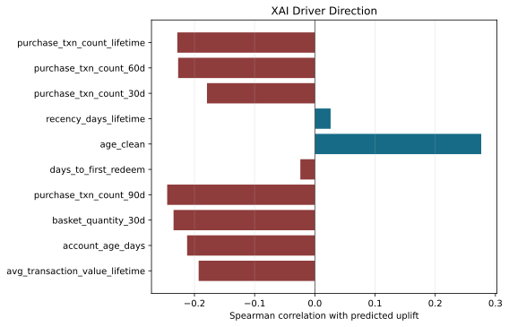
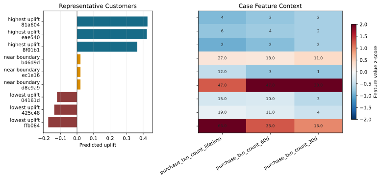

# AutoLift Explainability Pack

This pack adapts the visual explanation structure from `human_baseline_uplift.ipynb` for the final leakage-clean AutoLift candidate. It adds model-performance visuals, targeting diagnostics, prediction-level explanation, representative customers, and an agent decision timeline.

## Final Honest Human vs AutoLift

Both sides are selected without using the sealed test set. The human notebook selects `solo_model_xgb` by 5-fold CV after validation screening. AutoLift selects `RUN-f1c30175` / `two_model_lightgbm` by validation-top-3 CV.

| Metric | AutoLift CV-selected | Human CV-selected | AutoLift - Human |
| --- | --- | --- | --- |
| CV mean normalized Qini | 0.396226 | 0.40949 | -0.013264 |
| CV std normalized Qini | 0.060313 | 0.08755 | -0.027237 |
| Test normalized Qini | 0.248455 | 0.20412 | +0.044335 |
| Test raw Qini AUC | 309.9871 | 299.1256 | +10.8615 |
| Test uplift AUC | 0.058746 | 0.05782 | +0.000926 |
| Test uplift@5% | 0.183569 | 0.1552 | +0.028369 |
| Test uplift@10% | 0.111772 | 0.09231 | +0.019462 |
| Test uplift@30% | 0.058085 | 0.05187 | +0.006215 |

The final honest comparison is not a one-line domination claim. Human is slightly ahead on CV mean normalized Qini, while AutoLift is more stable across folds and stronger on sealed-test normalized Qini, raw Qini, uplift AUC, and top-k lift at 5%, 10%, and 30%.

## AutoLift Curves

The notebook did not leave prediction-level human artifacts in this workspace, so the human comparison is shown through notebook-reported metrics instead of an overlaid human curve.

## Prediction-Level XAI

The final AutoLift explanation is generated from the cached model, the feature artifact, and held-out prediction rows for `RUN-f1c30175`. Method: `cached_model_permutation`. Rows used: `500`.

| Rank | Feature | Sensitivity | Spearman | Direction |
| --- | --- | --- | --- | --- |
| 1 | purchase_txn_count_lifetime | 0.026598 | -0.2285 | higher_feature_lower_uplift |
| 2 | purchase_txn_count_60d | 0.023870 | -0.2271 | higher_feature_lower_uplift |
| 3 | purchase_txn_count_30d | 0.023254 | -0.1792 | higher_feature_lower_uplift |
| 4 | recency_days_lifetime | 0.020944 | 0.0262 | higher_feature_higher_uplift |
| 5 | age_clean | 0.018747 | 0.2764 | higher_feature_higher_uplift |
| 6 | days_to_first_redeem | 0.015667 | -0.0241 | higher_feature_lower_uplift |
| 7 | purchase_txn_count_90d | 0.015546 | -0.2453 | higher_feature_lower_uplift |
| 8 | basket_quantity_30d | 0.013517 | -0.2347 | higher_feature_lower_uplift |
| 9 | account_age_days | 0.012317 | -0.2122 | higher_feature_lower_uplift |
| 10 | avg_transaction_value_lifetime | 0.011337 | -0.193 | higher_feature_lower_uplift |

Permutation sensitivity explains model behavior; it is not causal proof of treatment effect. Age/account-age features remain prominent, so this explanation should be presented with the feature-policy caveat already documented in the robustness audit.

## Representative Cases

| Group | Client | Predicted uplift | purchase_txn_count_lifetime | purchase_txn_count_60d | purchase_txn_count_30d |
| --- | --- | --- | --- | --- | --- |
| highest uplift | eb7881a604 | 0.42609 | 4 | 3 | 2 |
| highest uplift | 1222eae540 | 0.422096 | 6 | 4 | 2 |
| highest uplift | cbc08f01b1 | 0.364486 | 2 | 2 | 2 |
| near boundary | 6c1bb46d9d | 0.02101 | 27.0 | 18.0 | 11.0 |
| near boundary | 3eeeec1e16 | 0.020972 | 12.0 | 3 | 1 |
| near boundary | 5b82d8e9a9 | 0.020915 | 47.0 | 47.0 | 28.0 |
| lowest uplift | 80c304161d | -0.12101 | 15.0 | 10.0 | 3 |
| lowest uplift | 0b3c425c48 | -0.137581 | 19.0 | 11.0 | 4 |
| lowest uplift | 7d7cffb084 | -0.174035 | 66.0 | 33.0 | 16.0 |

The case view converts raw prediction-level XAI into human-readable examples: strongest recommended targets, near-boundary customers, and low-uplift or potential sleeping-dog cases.

## Decile Lift

The first decile is the top predicted-uplift group and should show the clearest treatment/control response separation if the ranking is useful.

## Agent Reasoning Timeline

| Step | Run | Learner | Estimator | Held-out Qini | Verdict | Decision Evidence |
| --- | --- | --- | --- | --- | --- | --- |
| 1 | RUN-447718f5 | two_model | logistic_regression | 309.7954 | baseline |  |
| 2 | RUN-9c2b8311 | class_transformation | gradient_boosting | 294.6742 | inconclusive | The trial's hold-out uplift-AUC fell from 0.04667 (baseline) to 0.04245 and Qini-AUC from 309.80 to 294.67, so it fails to beat the existing model. |
| 3 | RUN-bfd6fa1c | two_model | xgboost | 310.2122 | supported | The trial's held-out uplift AUC rose from 0.0467 to 0.0580 (+24%), and Qini AUC edged up from 309.8 to 310.2, with uplift@5% improving to 0.1315. |
| 4 | RUN-f7bdb1dc | class_transformation | xgboost | 325.9836 | supported | The new model outperforms the prior champion on held-out uplift metrics: Qini AUC rises from 310.21 to 325.98 and uplift-AUC from 0.058026 to 0.058... |
| 5 | RUN-dd10fc91 | two_model | lightgbm | 300.1975 | inconclusive | The new model's held-out Qini AUC dropped from 325.98 to 300.20 and uplift-AUC fell from 0.0589 to 0.0563 versus the prior champion, missing the ta... |
| 6 | RUN-c5e6e86f | class_transformation | lightgbm | 331.7694 | supported | The LightGBM model improved held-out Qini AUC from 325.98 to 331.77 (up 5.79) and uplift-AUC from 0.05888 to 0.06149 (up 0.00261), both exceeding t... |

This timeline is a quarantined process trace from the earlier adaptive loop. It is useful for explaining how the agent reasoned, but not for final model selection because those iterations could see held-out feedback. The final reportable selection is the validation-top-3 plus CV candidate above.

## Source Notes

- Final AutoLift comparison metrics: `results/run_20260430_best/validation_top3_cv_leaderboard.csv`, `results/run_20260430_best/validation_top3_cv_audit.md`, and `artifacts/uplift/cv_top3_validation_only_20260501_123000/rank_03_RUN-f1c30175/cv_summary.json`.
- Prediction-level XAI summary: `autolift_cv_selected_xai_summary.json`.
- Prediction-level XAI inputs: `/home/tough/Agentic ML/artifacts/uplift/scratch_full_rerun_20260501_034315/agentic_tuning_validation_only/feature_recipe_fd65515ef37c/AT-02-14-two-model-lightgbm/model.pkl`, `/home/tough/Agentic ML/artifacts/uplift/scratch_full_rerun_20260501_034315/features/uplift_features_train_2fbce137df43.csv`, and `/home/tough/Agentic ML/artifacts/uplift/scratch_full_rerun_20260501_034315/agentic_tuning_validation_only/feature_recipe_fd65515ef37c/AT-02-14-two-model-lightgbm/held_out_predictions.csv`.
- Human metrics: `human_baseline_uplift.ipynb` outputs. The corrected CV-selected champion is `solo_model_xgb`.
- Metric caution: the final table compares raw Qini only where both sides expose raw Qini; normalized Qini values use each workflow's reported normalized metric.
